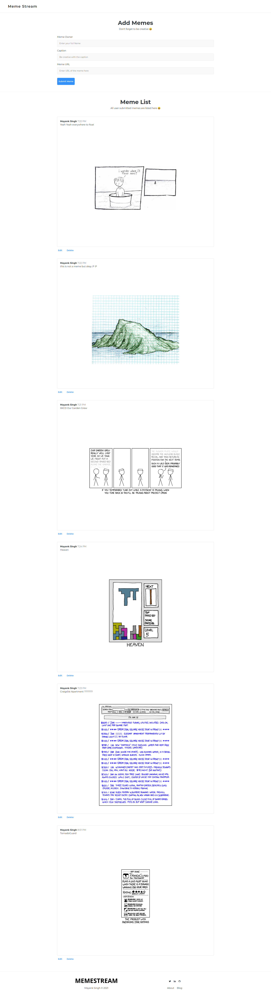

## Index

- [Index](#index)
- [About](#about)
- [Usage](#usage)
- [File Structure](#file-structure)
- [Gallery](#gallery)
- [Credit/Acknowledgment](#creditacknowledgment)

## About

this is MemeStream, a full stack web app created using node.js, express, react.js to crud operations on meme objects, this was created as a mini project submission at [Crio Winter of Doing](https://www.crio.do/crio-winter-of-doing/) challenge.

## Deployed Links

#### Backend
- [meme-stream-ms.herokuapp.com/v1/memes](https://meme-stream-ms.herokuapp.com/v1/memes)

#### Frontend
- [meme-stream-ms.netlify.app](https://meme-stream-ms.netlify.app/)

#### Video

- 
## Usage

```
NOTE - API Collection directory contains the postman API collection for this project.
```

**Backend**

If you just want to do a simple local test run of the backend application, you can  first

- Clone the repository
- Install dependencies by using the following commands.
- In case of any issues remove package-lock.json 
- run:

```bash
$ npm install
```

- create a `.env` file in root directory and assign the following environment variables
`NOTE: don't version control your .env file, make sure .env is added in .gitignore file`
```bash
$ touch .env #in project 
$ echo "NODE_ENV=development" >> .env
$ echo "PORT=8082" >> .env
$ echo "MONGODB_URL=mongodb://127.0.0.1:27017/memeapp" >> .env
#if you want then use mongoimport appropriately to import sample data from data/ directory 
```

- Finally run the application using 

```bash
$ npm start
```  


**Frontend**

If you just want to do a simple local test run of the frontend application, you can  first

- Install dependencies by using the following commands.
- In case of any issues remove package-lock.json & retry
- run:

```bash
$ cd frontend/
$ npm install
```

- open  `frontend/src/ipConfig.json` file and assign the ip as
```
{"ip": "127.0.0.1"}
```

- Finally run the application in another terminal using :

```bash
$ npm start
```  

## File Structure
- Below is the current file structure.

```bash
.
├── data
│   └── export_memeapp_memes.json
├── API Collection
├── frontend
│   ├── package.json
│   ├── package-lock.json
│   ├── public
│   │   ├── favicon.ico
│   │   ├── index.html
│   │   ├── manifest.json
│   │   └── robots.txt
│   ├── setup.sh
│   └── src
│       ├── App.css
│       ├── App.js
│       ├── App.test.js
│       ├── components
│       │   ├── AspectRatio.js
│       │   ├── Footer.js
│       │   ├── Home.js
│       │   ├── Meme.js
│       │   ├── MemeList.js
│       │   ├── SectionHeader.js
│       │   ├── Section.js
│       │   └── SubmitForm.js
│       ├── index.css
│       ├── index.js
│       ├── ipConfig.json
│       ├── reportWebVitals.js
│       └── setupTests.js
├── img
│   └── 1.png
├── package.json
├── package-lock.json
├── README.md
├── .env
└── src
    ├── app.js
    ├── config
    │   └── config.js
    ├── middleware
    │   └── middleware.js
    ├── models
    │   └── meme.model.js
    └── routes
        └── v1
            ├── index.js
            └── meme.route.js

13 directories, 35 files
```

## Gallery

<p align="center">
  
</p>


## Credit/Acknowledgment
- [Mayank Singh](https://twitter.com/codemonk08_)
